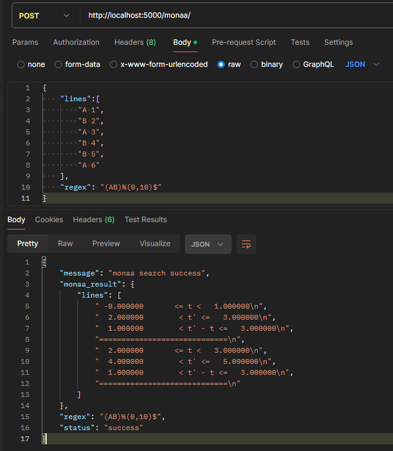

# TimeTrace

Better Timed Pattern Searching in Log Files

## To run the frontend prject
Clone the github project
cd into the project 
`cd TimeTrace`

### Install the necessary node packages
`npm i`

### Start the project
`npm start`

## MONAA backend
Because this project uses the MONAA tool that only runs on ubuntu, a seperate backend server has been set up and runs on CLAAUDIA.
For the frontend to connect to CLAAUDIA, it is necessary with an SSH tunnel.

### SSH tunnel setup
**Step 1 - Private key**
Save your private key (<private_key.pem>) somewhere safe.

**Step 2 - SSH**
Open a terminal and run the following ssh command:
`ssh -i "path/to/private_key.pem" ubuntu@130.225.37.239 -L 5000:localhost:5000`
This will tunnel port 5000 on the server to localhots:5000.

**Step 3 - Open browser**
Open your browser and go to localhost:3000 where the TimeTrace frontend will be hosted.

Follow the guides on the home page on how to use TimeTrace.

*You should not need anything else from this guide to use the tool unless you are a developer*
---

### SSH information
Blogpost: https://www.combell.com/en/help/kb/create-an-openstack-linux-instance-and-connect-to-it-via-internet/

Ubuntu server: https://strato-new.claaudia.aau.dk/project/instances/
Ubuntu server IP: http://130.225.37.239

### Start monaa flask server
`cd monaa-backend` 

(`git pull`)

`nohup python3 -m flask --app server run &`
This should start the flask server and you should be able to close the terminal without the server shutting down.

### Check running python scripts and kill them
To check what python processes are running, use command:
`pgrep python3`

To kill a puthon process, use command
`sudo kill <process-id>`
(https://medium.com/analytics-vidhya/deploy-a-flask-app-on-amazon-aws-ec2-and-keep-it-running-while-you-are-offline-38d22571e2c5)

### Postman
Import `P6.postman_collection.json` in your Postman App.

**POST Body**
In the form-data body add two keys: "file" and "regex".
Upload file P6\experiments\logfiles\logMappedAB.txt to the file value.
Add a valid timed regular expression in the value field of the "regex" key.

Your request should look something like below

Send your request and view the response

### Recommended extensions for VSCode:
Headwind (heybourn.headwind)